# Sail Kokokahi

## Table of contents
- [Deployment](#deployment)
- [Overview](#overview)
- [Mockup Pages](#mockup-pages)
- [Milestone 1](#milestone-1)
- [Milestone 2](#milestone-2)

### [Team Contract](https://docs.google.com/document/d/1g-LGbroK5dOsta1CuUrlV2K-iqaDX6juGQYbdOwcRJo/edit?tab=t.0)
Team Members: Ethan Christman, John Holt, Nalani Klopfenstein, Jett Perry

## Deployment

See our project deployed at Vercel [here](https://sail-kokokahi-nine.vercel.app/)

## Overview

Sail Kokokahi is a social/recreation club established in 2022 as a way to establish contact among people who share the love of recreational boat sailing. They are located at Kaneohe Bay on Oahu, Hawaii and need a way to enforce their "Work, Play, Pay" policy. This policy was designed to ensure that each and every member of the club contributes to the clubs growth through social engagement and volunteer work. Each member is expected to meet the annual quota of 6 hours through work such as:

- Approved activities such as maintenance projects or club clean-up days (1.5hrs per event)
- Volunteering at club events (1hr per event)
- Helping organize social activities (1hr per event)

If members do not meet the quota of 6 hours they will be billed at 20 dollars per unfulfilled hour. The problem with enforcing this policy resides in the members volunteer hours being tracked manually. Some members are unsure if they have met the quota for the year, while others are not fulfilling the commitment at all.

To solve this problem, our team will work torwards making a web application to mangage and monitor the volunteer hours contributed by each club member. The web application will enable members to monitor their own volunteer hours, and allow administrators to track and automate the billing process for members with unfulfilled volunteer hours.

## Mockup Pages

- **Landing Page**
 
The intial landing page will simply direct club members to sign in to their accounts and does not provide any information until an account is created.

  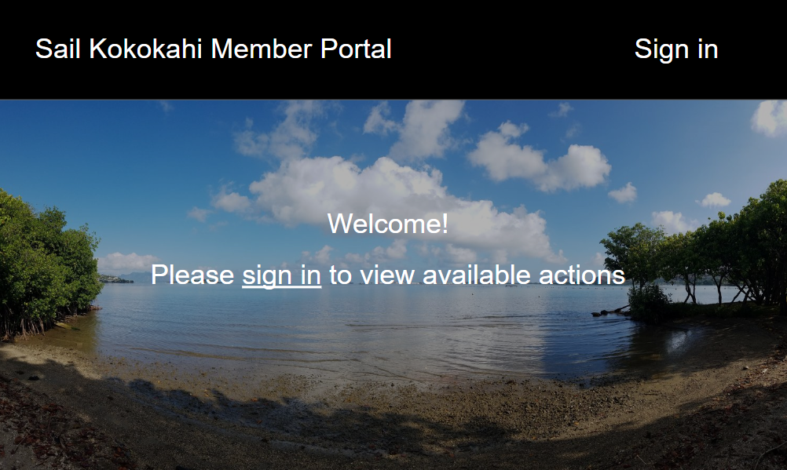

- **Member Landing Page**
 
Once users sign in they will be redirected to the user landing page which will present them with 3 different actions: event sign up, event check in, and a dashboard where they can view their hours

  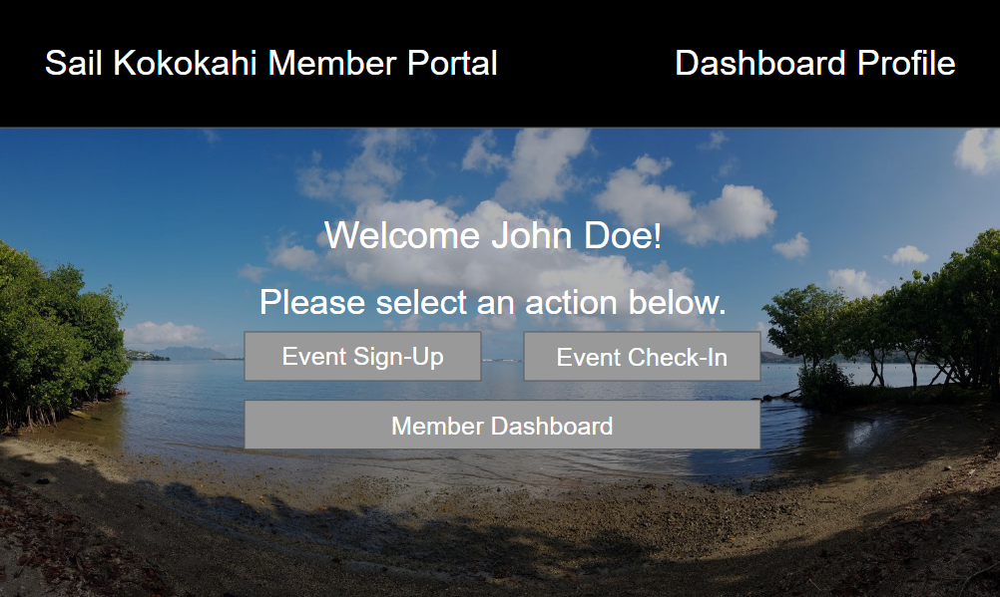

- **Member Dashboard**
 
On the member dashboard screen, users will be able to view their pending hours and their total hours contributed for the year. The "pending" hours are hours that have yet to be approved by a member with administrative rights. The page will also have an event history where users can see events that they have signed up for throughout the year.

  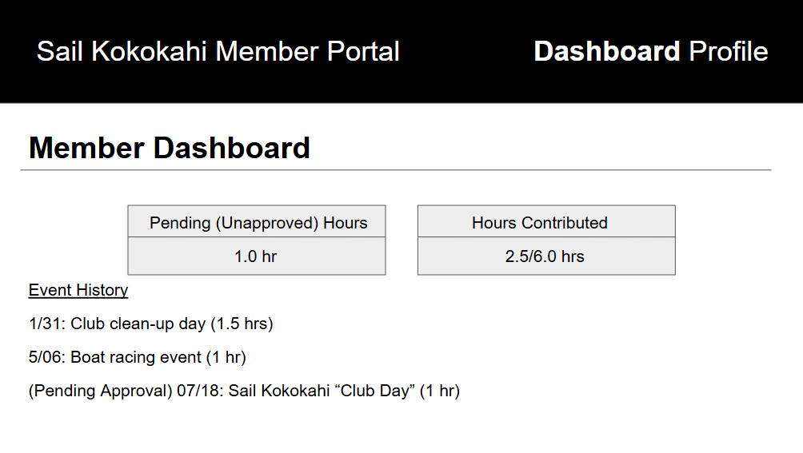

- **Event Sign-Up**
 
On the event sign-up screen, users can view upcoming events that can contribute to their annual quota of 6 volunteer hours. Events will have an information drop down menu that displays the time, potential hours to be gained, and members attending.  The sign up button will move the event to the users "event-check-in" page that users can take advantage of on the day of the event.

  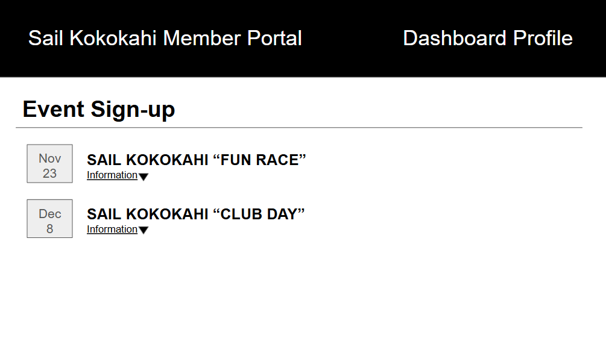

 

  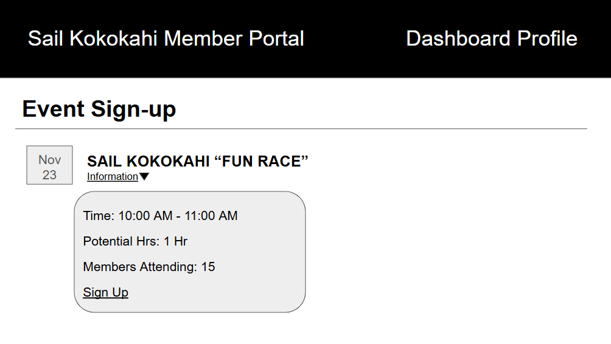

- **Event Check-In**
 
The event check-in screen will have a simillar format to the event sign-up screen. However, unlike the sign-up screen, only events that users have "signed up" for will show up here. The event will have a new check-in dropdown that users will be able to use to check-in to events they attend. Upon checking in the user will now have unapproved hours on the dashboard screen that can then be approved by administrative personnel.

  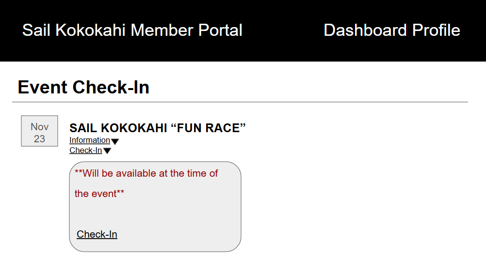

- **Member Profile**
 
Users will also have their own personal profiles where they will be able to enable or disable email notifications, edit basic profile information, and their billing information for payments to the Kokokahi Sail team.

  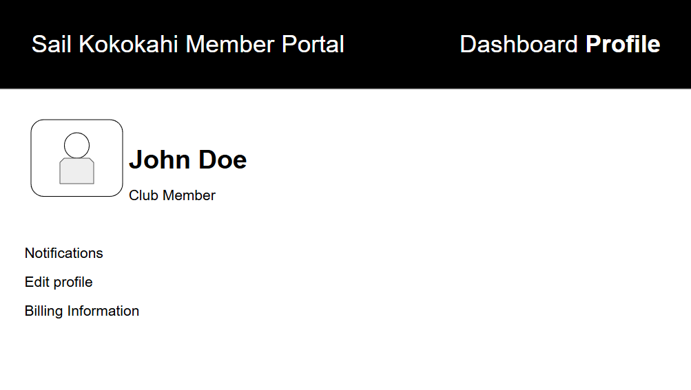

- **Admin Landing Page**
 
Once an administrative user signs in they will be redirected to the user landing page which will present them with some admin exclusive actions such as: admin dashboard, member roles, and an hours approval page.

  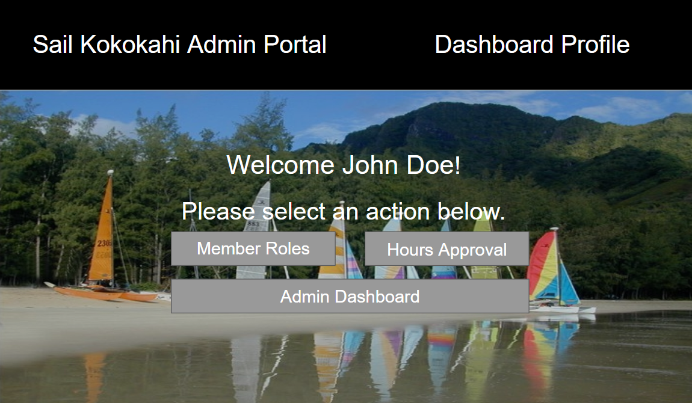

- **Admin Dashboard**
 
On the admin dashboard, admin users will be able to view a table that contains club member information, and the hours each member has logged for the year. This file will be an exportable excel sheet as well.

  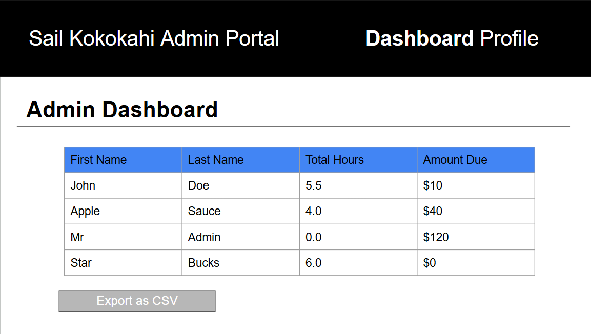

- **Member Roles**
 
Admin users will also have access to the member roles page which they can use to adjust permissions of other members if they also require administrative rights.

  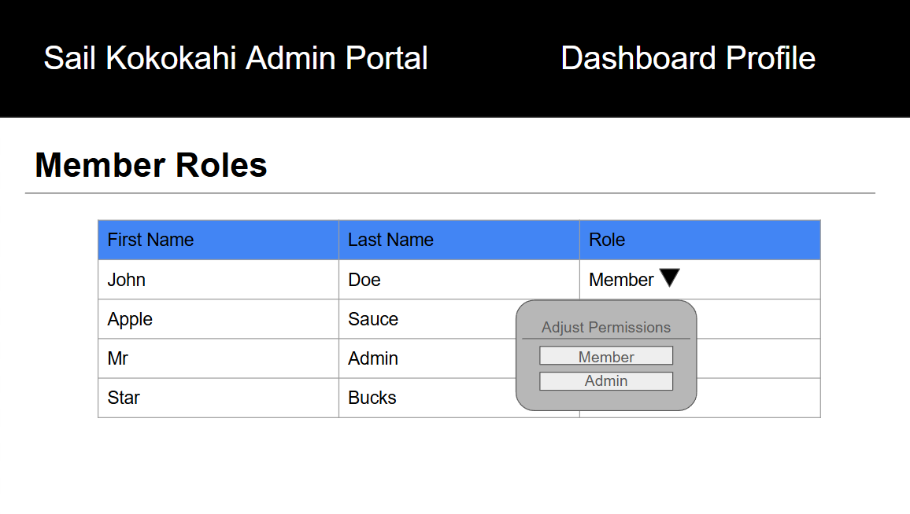

- **Hours Approval**
 
The hours approval page is where members who have checked-in for a particular event can be viewed by admin users. Admin users will be able to either approve or reject their hours depending on if they actually attended the event or not.

  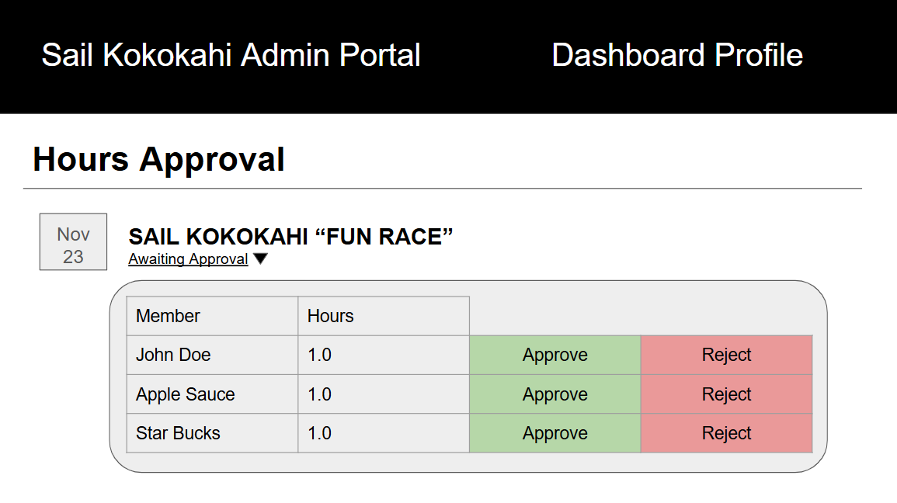

## Milestone 1

### [M1 Progress Page](https://github.com/orgs/Sail-Kokokahi/projects/2)
- **Landing page**

  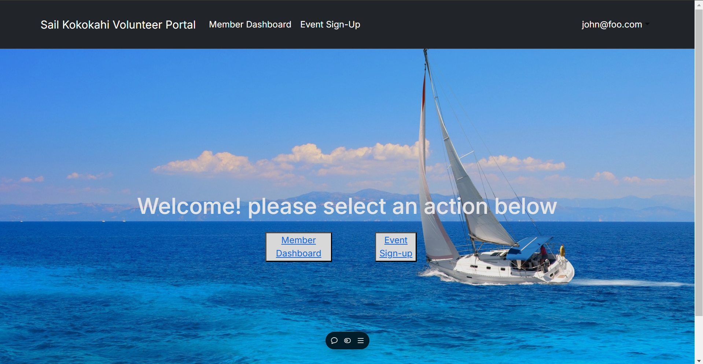

- **Member Dashboard**

  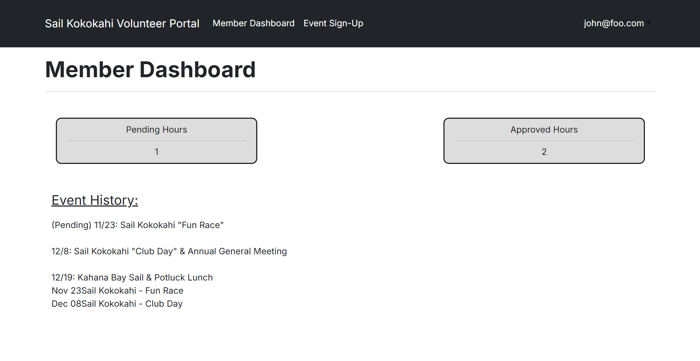

- **Admin Dashboard**

  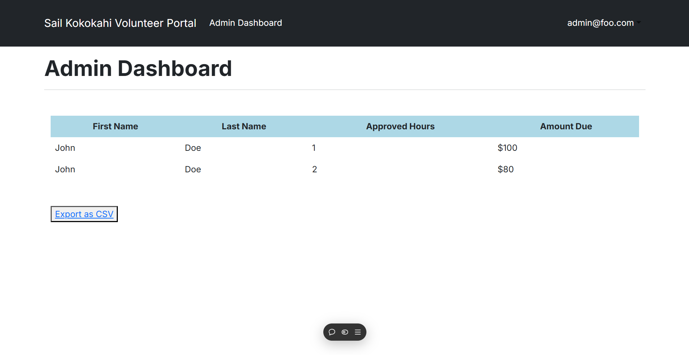

- **Event Signup**

  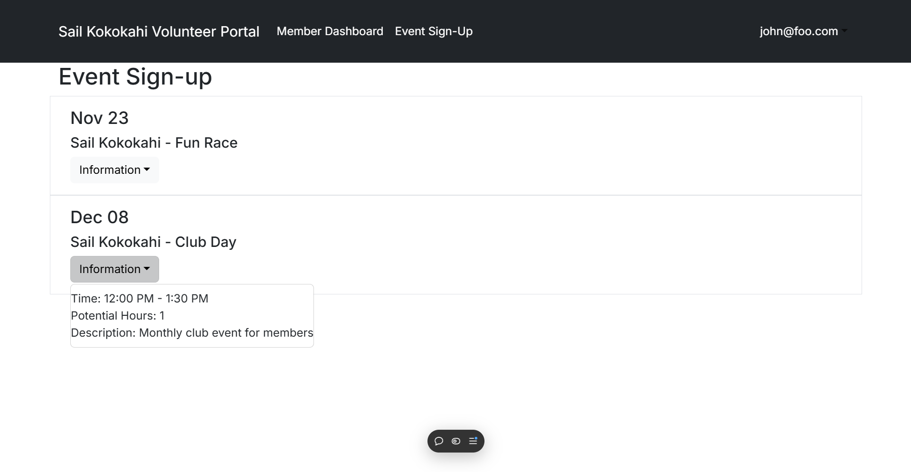

- **Profile Management**

  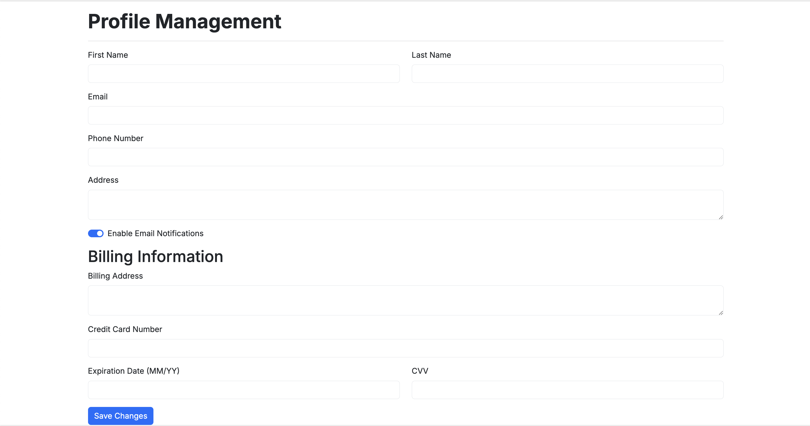

- **Settings**

  

## Milestone 2

### [M2 Progress Page](https://github.com/orgs/Sail-Kokokahi/projects/4/views/1)
