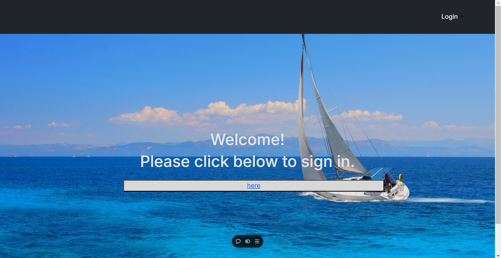
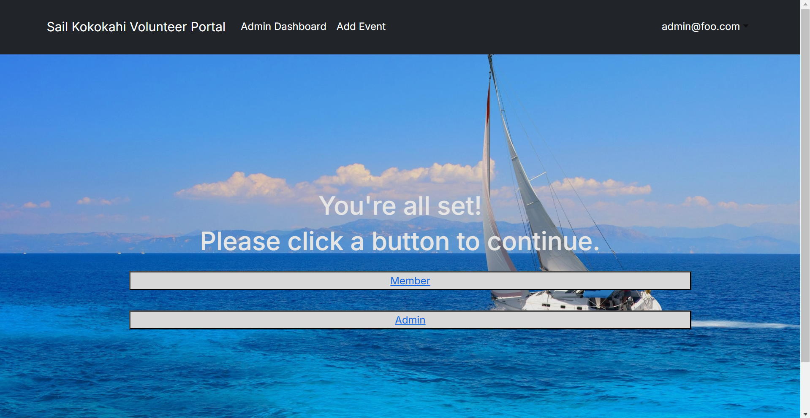
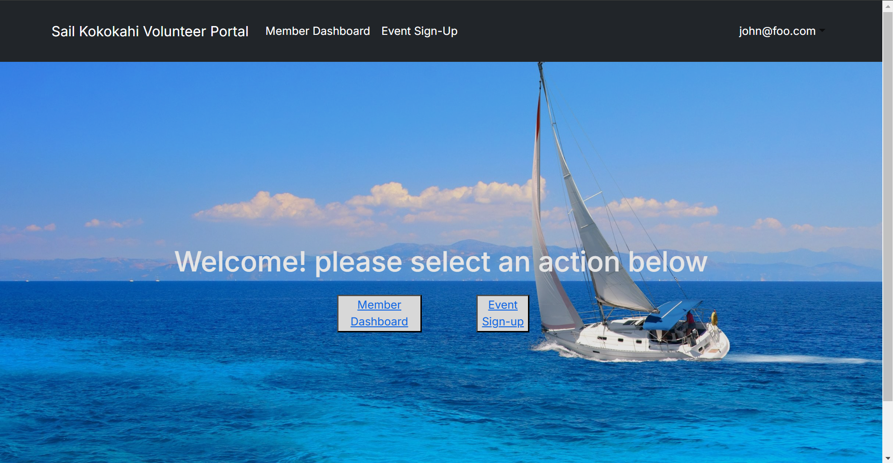
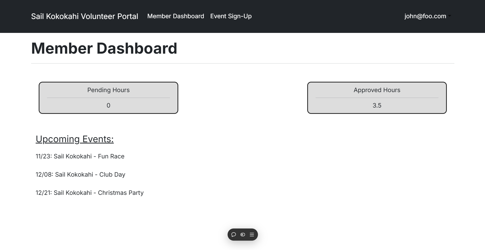
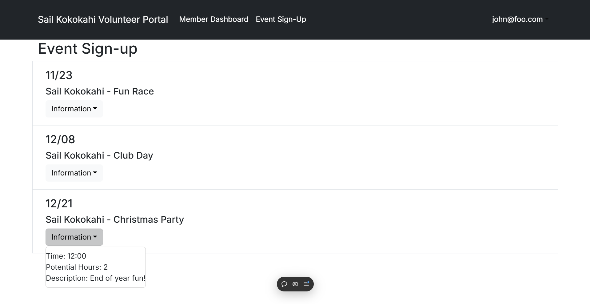
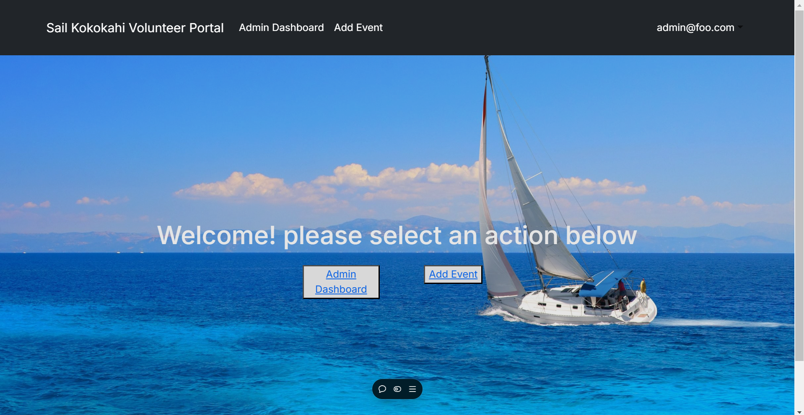
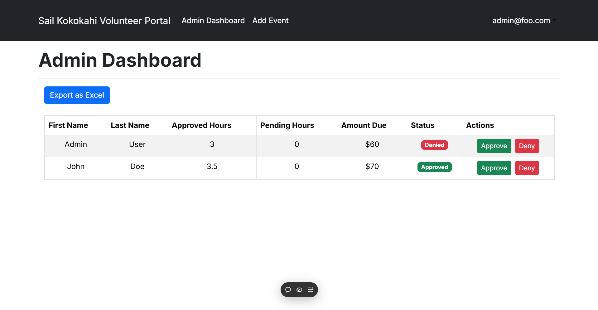
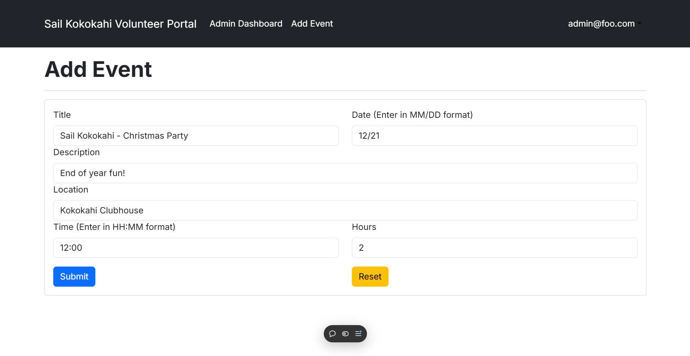
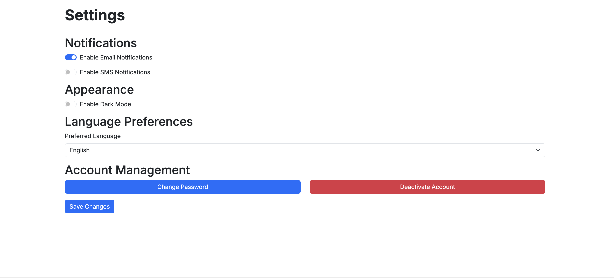
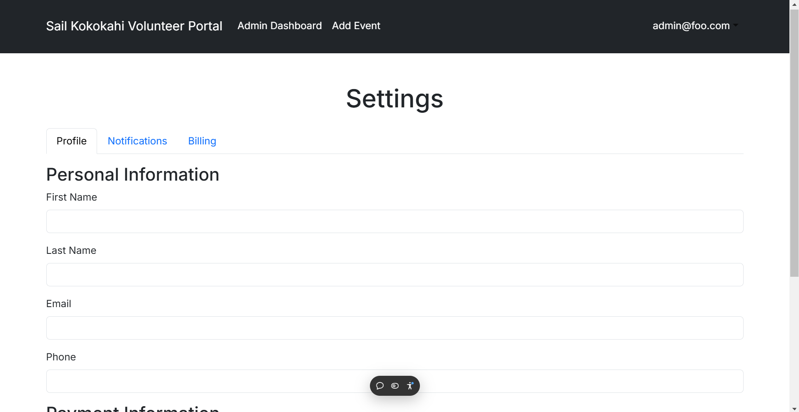

# Sail Kokokahi

## Table of contents
- [Deployment](#deployment)
- [Overview](#overview)
- [Developer Guide](#developer-guide)
- [User Guide](#user-guide)
- [Mockup Pages](#mockup-pages)
- [Milestone 1](#milestone-1)
- [Milestone 2](#milestone-2)
- [Milestone 3](#milestone-3)

### [Team Contract](https://docs.google.com/document/d/1g-LGbroK5dOsta1CuUrlV2K-iqaDX6juGQYbdOwcRJo/edit?tab=t.0)
Team Members: Ethan Christman, John Holt, Jett Perry

## Deployment

See our project deployed at Vercel [here](https://sail-kokokahi-nine.vercel.app/)

## Overview

Sail Kokokahi is a social/recreation club established in 2022 as a way to establish contact among people who share the love of recreational boat sailing. They are located at Kaneohe Bay on Oahu, Hawaii and need a way to enforce their "Work, Play, Pay" policy. This policy was designed to ensure that each and every member of the club contributes to the clubs growth through social engagement and volunteer work. Each member is expected to meet the annual quota of 6 hours through work such as:

- Approved activities such as maintenance projects or club clean-up days (1.5hrs per event)
- Volunteering at club events (1hr per event)
- Helping organize social activities (1hr per event)

If members do not meet the quota of 6 hours they will be billed at 20 dollars per unfulfilled hour. The problem with enforcing this policy resides in the members volunteer hours being tracked manually. Some members are unsure if they have met the quota for the year, while others are not fulfilling the commitment at all.

To solve this problem, our team will work torwards making a web application to mangage and monitor the volunteer hours contributed by each club member. The web application will enable members to monitor their own volunteer hours, and allow administrators to track and automate the billing process for members with unfulfilled volunteer hours.

## Developer Guide

## User Guide

Upon visiting our website you will land on the initial landing page, from here you are directed to sign in before accessing the "member" or "admin" pages.

  

After signing in you can choose to either be redirected to the "member" or "admin" landing page, admin users cannot access the member landing page and vice versa.

  

- **Member User Guide**
As a member you can access the member landing page, this page displays buttons that link to the pages that are available to members.

  

On the member dashboard you can see your own "pending" or "approved" hours. You can also view upcoming events that administrative users create.

  

On the event sign-up page users can see upcoming events and details about the event. (currently does not allow users to sign up)

  

- **Admin User Guide**
As an admin you can access the member landing page, this page displays buttons that link to the pages that are available to admins.

  

On the admin dashboard you can see a table of all members in the database. The table displays the users approved hours, pending hours, and allows for admins to approve or deny pending hours.

  

On the add event page, you can create events for users to view and check into. (eventually this page will have a printable qr code for admins to use at the event for easy check in.

  

## Mockup Pages

- **Landing Page**
 
The intial landing page will simply direct club members to sign in to their accounts and does not provide any information until an account is created.

  

- **Member Landing Page**
 
Once users sign in they will be redirected to the user landing page which will present them with 3 different actions: event sign up, event check in, and a dashboard where they can view their hours

  

- **Member Dashboard**
 
On the member dashboard screen, users will be able to view their pending hours and their total hours contributed for the year. The "pending" hours are hours that have yet to be approved by a member with administrative rights. The page will also have an event history where users can see events that they have signed up for throughout the year.

  

- **Event Sign-Up**
 
On the event sign-up screen, users can view upcoming events that can contribute to their annual quota of 6 volunteer hours. Events will have an information drop down menu that displays the time, potential hours to be gained, and members attending.  The sign up button will move the event to the users "event-check-in" page that users can take advantage of on the day of the event.

  

 

  

- **Event Check-In**
 
The event check-in screen will have a simillar format to the event sign-up screen. However, unlike the sign-up screen, only events that users have "signed up" for will show up here. The event will have a new check-in dropdown that users will be able to use to check-in to events they attend. Upon checking in the user will now have unapproved hours on the dashboard screen that can then be approved by administrative personnel.

  

- **Member Profile**
 
Users will also have their own personal profiles where they will be able to enable or disable email notifications, edit basic profile information, and their billing information for payments to the Kokokahi Sail team.

  

- **Admin Landing Page**
 
Once an administrative user signs in they will be redirected to the user landing page which will present them with some admin exclusive actions such as: admin dashboard, member roles, and an hours approval page.

  

- **Admin Dashboard**
 
On the admin dashboard, admin users will be able to view a table that contains club member information, and the hours each member has logged for the year. This file will be an exportable excel sheet as well.

  

- **Member Roles**
 
Admin users will also have access to the member roles page which they can use to adjust permissions of other members if they also require administrative rights.

  

- **Hours Approval**
 
The hours approval page is where members who have checked-in for a particular event can be viewed by admin users. Admin users will be able to either approve or reject their hours depending on if they actually attended the event or not.

  

## Milestone 1

### [M1 Progress Page](https://github.com/orgs/Sail-Kokokahi/projects/2)
- **Landing page**

  

- **Member Dashboard**

  

- **Admin Dashboard**

  

- **Event Signup**

  

- **Profile Management**

  

- **Settings**

  

## Milestone 2

### [M2 Progress Page](https://github.com/orgs/Sail-Kokokahi/projects/4/views/1)
- **Member Landing page**
 
The member landing page has buttons that redirect the user to the pages members can access.

  

- **Member Dashboard**
 
The member dashboard displays the user with their current pending hours, approved hours and all the upcoming events.

  

- **Event Sign-up**
 
The member event sign-up page has all of the upcoming events that admins can create, all of these events are also viewable on the member dashboard under the "upcoming events" section.

  

- **Admin Landing page**
 
The admin landing page has buttons that redirect the user to the pages admins can access.

  

- **Admin Dashboard**
 
The admin dashboard shows a spreadsheet of all the users in the database along with their pending hours and approved hours. Admins can choose to approve or deny pending hours of the users who have checked into events.

  

- **Add Event**
 
The add event page is only accessible to admins and creates a new event in the database for members to be able to see and check into.

  

- **Settings**
 
The settings page is accessible to all members or admins, it allows the user to adjust their information if needed or enable notifications.

  

## Milestone 3

### [M3 Progress Page](https://github.com/orgs/Sail-Kokokahi/projects/6)
